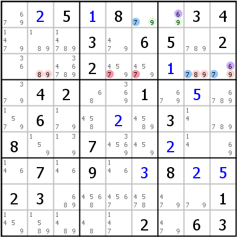
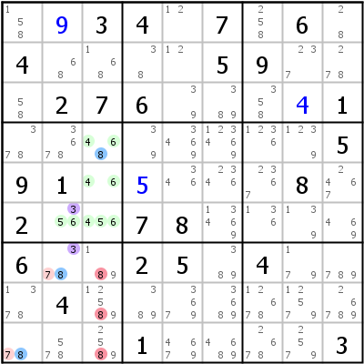
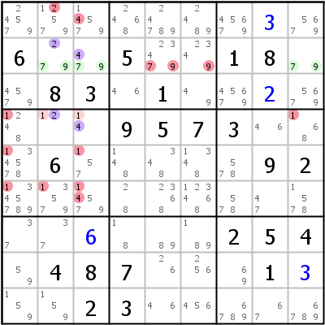
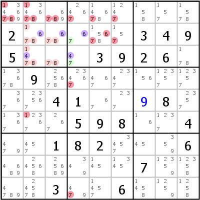
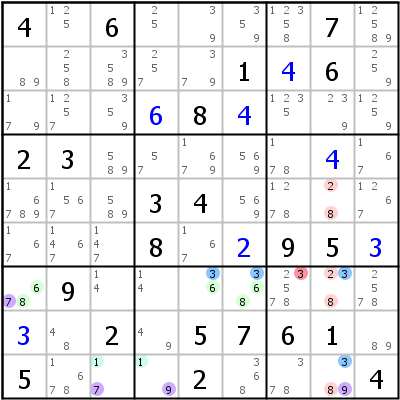
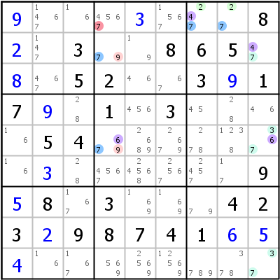
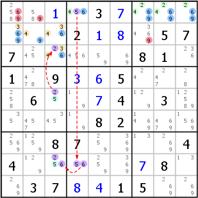
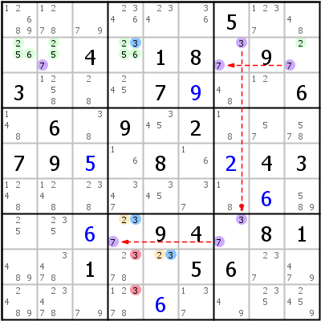
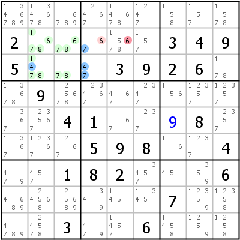
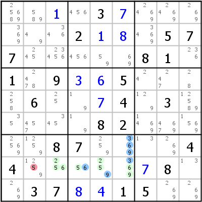

# ALS (Almost Locked Sets)

## Table of Contents

- [Introduction](#in)
- - [Almost Locked Set (ALS)](#in1)
  - [Restricted Common Candidate (RCC)](#in2)
  - [ALS Overlap](#in3)
- [ALS-XZ](#axz)
- - [Singly linked ALS-XZ](#axz1)
  - [Doubly linked ALS-XZ](#axz2)
- [ALS-XY-Wing](#axy)
- [ALS Chain](#ach)
- [Death Blossom](#db)

------------------------------------------------------------------------

# Introduction

## Almost Locked Set (ALS)

A Locked Set (or [Naked Set](tech_naked.md)) is a group of N unsolved cells within one house that together contain only N candidates. It is a simple concept that allows to eliminate all locked set candidates from all other cells in the same house as the locked set itself.

An Almost Locked Set is a group of unsolved cells within one house, that would be a Locked Set, if only one candidate was missing. More formally: A group of N cells with N+1 candidates. Every solver knows that phenomenon: when looking for Naked Subsets, we usually find lots and lots of ALS instead.

An ALS itself does nothing, but it is possible to use ALS as nodes in chains (see [ALS in Chains](tech_chains.md#in4)). Another possibility to get something out of an ALS is to combine it with another ALS. Techniques that use this principle are described here.

## Restricted Common Candidate (RCC)

To combine two ALS they must share at least one candidate. "Share" means, that all instances of the candidate in ALS 1 see all instances of that candidate in ALS 2. Such a candidate is called a Restricted Common Candidate (or RCC for short).

The usefulness of an RCC lies in the fact, that it can be true only in one of the ALS: All cells of an ALS see each other, so one digit can be placed only once within an ALS. A RCC is even more restricted: Since all possible instances of an RCC in both ALS have to see each other, placing an RCC in any cell of those ALSes eliminates that digit completely from one of the two ALS. That ALS is thus turned into a Locked Set.

Sometimes two ALS share not only one RCC but two. These ALS are called "doubly linked" and are the basis for some pretty effective techniques.

## ALS Overlap

ALS are allowed overlap in all ALS techniques. There is only one restriction: The overlapping area between two ALS must not contain an RCC.

------------------------------------------------------------------------

# ALS-XZ

## Singly Linked ALS-XZ

This is the simplest ALS technique: Find two ALS that share one RCC (the RCC is called X). If both ALS contain a common digit Z that is not the RCC, Z can be eliminated from all non ALS cells that see all instances of Z within both ALS. An ALS-XZ is in fact an ALS Chain of length 2.

The logic behind ALS-XZ is quite simple too: Because of the RCC at least one of the ALS is turned into a Locked Set (we don't know yet which). Since both ALS contain digit Z, Z gets locked into at least one of the ALS. That means that in all ALS cells together one Z has to be placed. Any cell that sees all possible placements of Z can therefore not contain Z itself.

 

Example on the left: We have two ALS: ALS A (r1c67, candidates {679}) and ALS B (r3c289, {6789}). In both ALS digit 6 occurs only in block 3, it is therefore a RCC (X - marked violet). Both ALS have as common digit besides the RCC digit 7 (Z - marked blue in the image). Cells r3c56 are not part of one of the ALS and can see all ALS cells, that could possibly become 7. 7 can be eliminated from those cells.

Example on the right: A=r456c3,r6c2 {34568}, B=r7c2,r9c1 {378}, X=3, Z=8 =\> r789c3\<\>8. ALS A is a bit larger in that example (4 cells with 5 candidates), the principles are the same.

## Doubly Linked ALS-XZ

If the two ALS have two RCCs, things get really interesting. Remember that an RCC digit can only be placed in one ALS, thus turning the other ALS into a locked set. If we have two RCCs, one of them has to be placed in ALS A, turning ALS B into a locked set, the other has to be in ALS B, turning ALS A into a locked set (which RCC will be in which ALS, is yet unknown). Both RCCs in one ALS is impossible, because both RCCs would be eliminated from the other ALS leaving only N-1 candidates for N cells, which is of course invalid.

What can be concluded from a Doubly Linked ALS-XZ? Both RCCs are locked into one ALS, so the RCCs can be eliminated from all non ALS cells in the houses providing the RCCs. But more importantly, all non RCC digits get locked within their respective ALS and eliminate all digits outside the ALS that can see all instances of the digit in the ALS (the elimination can even be done in a cell belonging to the other ALS, making the ALS-XZ cannibalistic).

 

On the left: A=r2c239 {2479}, B=r4c23 {124}, X=2,4. ALS A and B are doubly linked by candidates 2 and 4, no additional common digit Z is present. All instances of RCC 2 are in column 2, that eliminates 2 from r1c2. All instances of RCC 4 are in column 3, which eliminates 4 from r16c3. ALS A has now the non RCC digits 7 and 9 left. All instances of both digits are restricted to row 2, so 7 and 9 can be eliminated from all other cells in row 2. ALS B has only digit 1 left, all instances of that digit are in row 4 and block 4, which eliminates all other 1s from those houses.

The ALS-XZ in the example on the right is the third move in this sudoku (after a [Hidden Single](tech_singles.md#h1) and a [Locked Candidates Type 1](tech_intersections.md#lc1)): A=r23c4 {467}, B=r2c23,r3c23 {14678}, X=4,6. RCC 4 is restricted to row 3 (no eliminations), RCC 6 to row 2 (r2c5\<\>6). ALS A has digit 7 left (eliminates from block 2 and column 4), ALS B has 1, 7, and 8 left (eliminating from block 1 and column 2 - column 2 only for digit 1). The last distinction is important: Digits 7 and 8 are restricted to block 1 an can only eliminate from that block. But digit 1 is restricted to the intersection of block 1 and column 2 and can thus eliminate from both houses.

------------------------------------------------------------------------

# ALS-XY-Wing

An ALS-XY-Wing needs three ALS A, B, and C (it is an ALS Chain of length three: z- A -x- C -y- B -z). ALS a shares RCC X with ALS C, ALS B shares RCC Y with ALS C (X and Y must not be the same digit). Both ALS A and B have a common digit Z. Z can be eliminated from all cells, that see all instances of Z in A and B.

The logic is the same as for an ALS Chain (see below): If Z is not in ALS A, then A has to contain X (only one digit may miss from an ALS). That means that ALS C has to contain Y (X is missing from C) and thus ALS B has to contain Z (Y is missing from B). The other way round works as well: If ALS B does not contain Z, ALS A must.

 

On the left: A=r7c156 {3678}, B=r579c8 {2389}, C=r9c34 {179}, X,Y=7,9, Z=3. RCC 7 is restricted to bock 7, RCC 9 to row 9 (both marked violet - the numbers are coincidence). The common digit 3 has to be placed in one of the blue cells, it can never be in r7c7.

On the right: A=r1c78 {247}, B=r25c4 {679}, C=r259c9 {3467}, X,Y=4,6, Z=7. Note that ALS C contains digit 7 as well, this is irrelevant for the move.

------------------------------------------------------------------------

# ALS Chain

ALS Chains are a series of ALS connected by RCCs. The first and the last ALS must contain a common digit, that digit is eliminated from all cells that see all instances of the digit in both ends of the ALS Chain. Some restrictions are put on the RCCs: No two adjacent RCCs may be the same. In fact when building ALS Chains which contain doubly linked ALS, choosing the correct RCCs is a bit more complicated than that. A discussion of all possibilities with doubly linked ALS is beyond the scope of that guide, see [Restricted Common Adjacency Rules](http://forum.enjoysudoku.com/viewtopic.php?t=6642) in the Player's Forum.

The logic: The chain proves, that if the common digit is not in the start ALS, it has to be in the end ALS, thus eliminating all peers to all instances of the common digit in the end ALS. If the common digit is in the start ALS, however, it eliminates the common digit from all peers of the start ALS. Both cases combined (a typical verity) provide the eliminations mentioned above.

Some explanations of ALS Chains (often called "ALS-XY-Chains") depend on the reversability of the chain. As a matter of fact, however, some more complicated chains with doubly linked ALS are not reversible. The logic described above holds even in those cases.

ALS Chains can be written in Nice Loop notation with the RCCs as weak links between the ALS.

 

Example on the left: 69- r1c4789 {24569} -5- r8c4 {56} -6- r58c3 {256} -2- r2c123,r3c3 {23469} -69. Nothing special with that chain, except that is has two common digits (6 and 9). The second ALS is a simple bivalue cell (the smallest possible ALS - two candidates in one cell).

Example on the right: 3- r2c1249 {23567} -7- r2c7 {37} -3- r7c7 {37} -7- r7c4,r8c5 {237} -3. Two ALS in that chain are doubly linked: r2c7 and r7c7 linked by {37}. This is valid, as long as all adjacent RCCs are different.

------------------------------------------------------------------------

# Death Blossom

A Death Blossom consists of a stem cell and petals. Every petal is an ALS that has an RCC with the stem cell. If a petal can be found for every candidate in the stem cell, and if all petal ALS have a common digit, that digit can be eliminated from all cells that see all instances of the common digit in all petals.

If overlapping is not allowed (standard in HoDoKu), it is very hard to find a Death Blossom with more than two candidates in the stem cell (such a Death Blossom is always an ALS-XY-Wing). If overlapping is allowed (no restrictions are needed), very interesting Death Blossoms can be found.

The logic behind Death Blossom is simple: One of the candidates in the stem cell must be true, thus locking the common digit in the connected ALS.

 

Example on the left: \[r3c4\], -4- r2c23,r3c23 {14678}, -7- r2c4 {67}. The stem cell r3c4 has RCC 4 with ALS r2c23,r3c23 and RCC 7 with ALS r2c4. Both ALS have a common digit 6, eliminating 6 from r2c5. This is a typical non overlapping Death Blossom that really is an ALS-XY-Wing.

Example on the right: \[r7c6\], -3- r8c3456 {23569}, -6- r8c4 {56}, -9- r8c345 {2569}. In this example ALS 2 and ALS 3 completely overlap with ALS 1 (cell r8c4 is contained in all three ALS!). This is valid. The common digit is 5 (6 is a common digit, but an RCC as well, it cannot be used for eliminations), the Death Blossom eliminates 5 from r8c2.

------------------------------------------------------------------------
