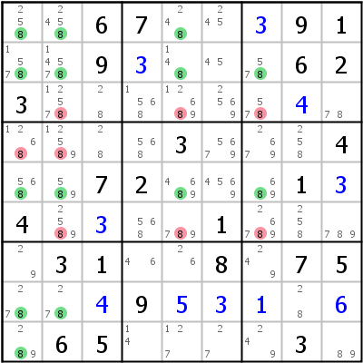
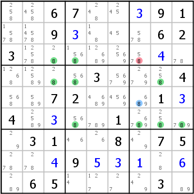
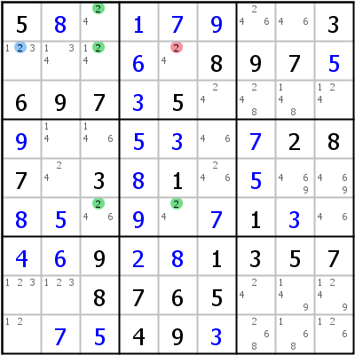
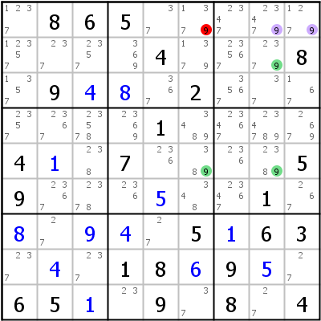
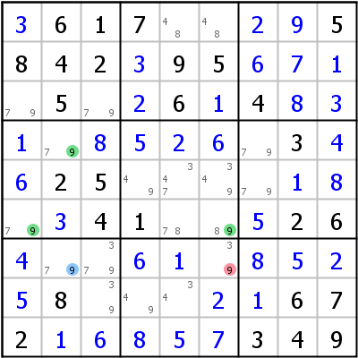
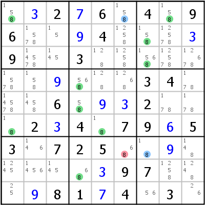
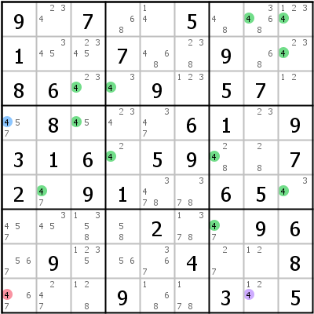
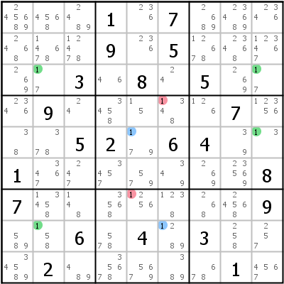
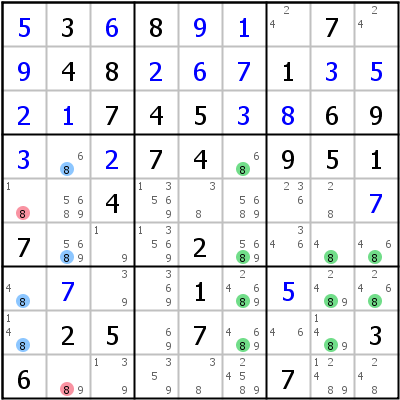

# Complex Fish

## Table of Contents

- [(Finned) Franken Fish](#ff)
- [(Finned) Mutant Fish](#mf)
- [Siamese Fish](#sf)

------------------------------------------------------------------------

Note: The techniques and examples on this page are meant for advanced players. Most sudokus would not need them.

# (Finned) Franken Fish

If at least one of the base or cover sets is a box, the resulting fish is called a Franken Fish. The fish rules remain unchanged.

 

The image on the left above shows a Franken Jellyfish: r125b7/c1257 leads to the following eliminations: r3c257,r4c12,r6c257\<\>8. On first sight it looks like a Basic Jellyfish in the rows. The only difference is that the fourth base set is not a row but a block: This makes it a Franken Fish.

The right side shows exactly the same sudoku state as the left but a different fish: c34b6/r346. There are three base/cover sets, so Swordfish. The base sets contain a block, so Franken Swordfish. And one base candidate is "left over": r5c7. This is a fin, so Finned Franken Swordfish. The elimination is r3c8.

Many advanced fish produce patterns that have been described under a different name. Most of these different patterns are easier to spot. The additional possibilities introduced by the use of boxes as base or cover sets lead to fishes with endo fins and cannibalism. The possible varieties are really endless, below are two examples of these types of fish:

 

The left example shows a Finned Franken X-Wing: Base sets are row 6 and block 1, cover sets are columns 3 and 5. 2 in r2c1 is not covered by a cover set and is therefore a fin. The only possible elimination of the Unfinned Franken Fish is in r2c5. Since it happens to see the fin, it becomes a real elimination. That pattern is better known as an [Empty Rectangle](tech_sdp.md#er).

The example on the right is a more complex fish type: Base sets are rows 1 and 5 and box 3, cover sets are columns 6 and 8 and box 2. Three base/cover sets means Swordfish, boxes in base/cover sets mean Franken Swordfish. Possible eliminations are r2c4, r24c6, and r4c8. On closer look we see, however, that base candidates r1c89 are not only in base set row 1, but in base set box 3 too: They have to be treated as fins ("endo fins"). Since none of the possible eliminations sees all the fins that leaves us with nothing to do. Fortunately, however, base candidate r1c6 is contained in two cover sets: cover set column 6 and cover set box 2, it is therefore a possible cannibalistic elimination. It does see all fins, so it becomes the real elimination for this fish (a Cannibalistic Finned Franken Swordfish).

------------------------------------------------------------------------

# (Finned) Mutant Fish

If we allow all possible types of houses in the base and cover sets of our fishes, the results get even more complicated. Again the smaller exemplars are often known under a different name.

 

Let's again start with the left side: Base sets are row 6 and column 2, cover sets are column 6 and block 4. Two sectors each means X-Wing, rows and columns mixed in the base sets means Mutant X-Wing. Base cell r7c2 is not covered so Finned Mutant X-Wing. The elimination is r7c6. This particular pattern is also known as a [2-String-Kite](tech_sdp.md#t2sk) or as [Turbot Fish](tech_sdp.md#tf) (which incidentally is not a fish, but a chain...).

The example above on the right side shows a Finned Mutant Jellyfish: r16c47/c1b358, fins in r1c6 and r7c7, the elimination is r7c6.

The example on the left doesn't look much more complicated than the Jellyfish above, but it is. It is the smallest available fish in the grid, a Finned Mutant Whale: 4 r35c89b49 r69c347b3 fr4c1 efr9c8 =\> r9c1\<\>4. Although it is funny to look at those monsters, it is highly unlikely that a human solver should find such a fish. It isn't even necessary: The elimination can be reproduced by a [Grouped Nice Loop](tech_chains.md#gnl) or a [Forcing Chain](tech_last.md#fc).

------------------------------------------------------------------------

# Siamese Fish

If at a given sudoku state two fishes of the same type exist, that occupy the same cells, but lead to different eliminations, those two fishes can be combined into one Siamese Fish. For a Siamese Fish to be possible, the fishes building it must be some kind of finned fish that differ in one cover set. The easiest form of a Siamese Sashimi X-Wing is better known as [Skyscraper](tech_sdp.md#sk).

 

The example on the left (posted on the Player's Forum) is a Siamese Sashimi Swordfish on 1: The first fish is in r358 c259, fin in r8c6, that eliminates 1 from r7c5, the second is in r358 c269, fin in r5c5, eliminating 1 from r4c6.

The second example is a Siamese Sashimi Jellyfish on 8 (each fish has two fins): The first fish is in r4678 c1689, fins in r4c2 and r6c2, eliminating 8 from r5c1 (note that although the second eliminated candidate r9c2 sees both fins, it is not a cover candidate and can therefore not be eliminated by the first fish alone). The second fish is in r4678 c2689, fins in r7c1 and r8c1, eliminating 8 from r9c2.

HoDoKu does support Siamese Fish, but only if option "Allow Duals/Siamese" is enabled.

------------------------------------------------------------------------
