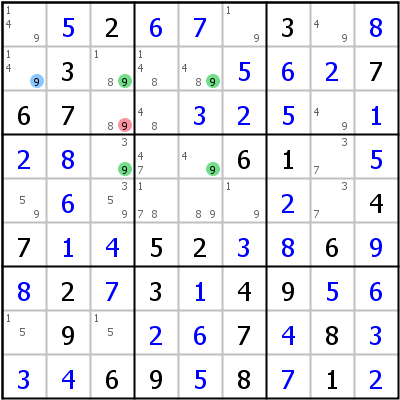
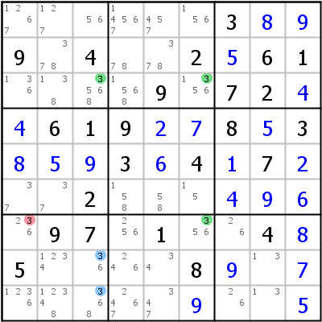
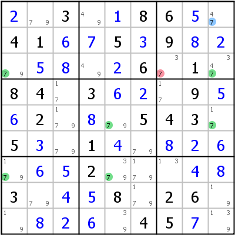
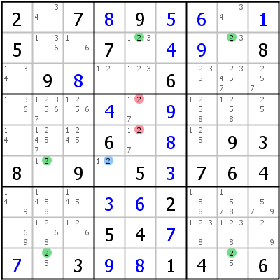
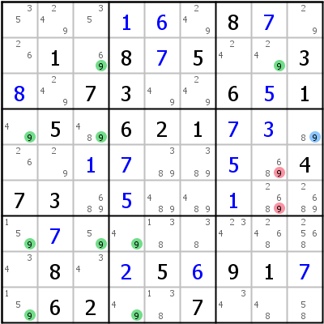
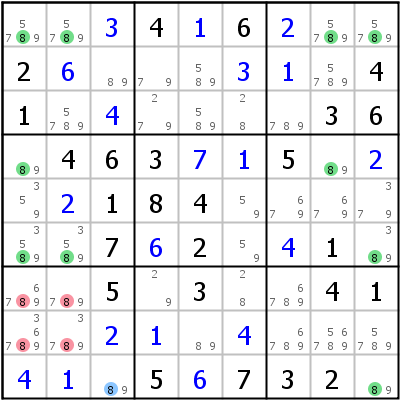

# Finned/Sashimi Fish

## Table of Contents

- [Finned/Sashimi X-Wing](#fbf2)
- [Finned/Sashimi Swordfish](#fbf3)
- [Finned/Sashimi Jellyfish](#fbf4)
- [Larger Finned/Sashimi Fish](#fbf567)

------------------------------------------------------------------------

For a detailed discussion of Finned/Sashimi Fishes please see [here](tech_fishg.md#ff).

# Finned/Sashimi X-Wing

A Finned X-Wing is a regular X-Wing, where one or more base candidates are not covered by a cover set. As explained in [Fish (general)](tech_fishg.md#ff), only those cover candidates can be eliminated that see all the fins (and are of course not base candidates).

A Finned Fish becomes Sashimi, if the remaining fish is incomplete (or degenerate), when all fins are false.

 

In the left example we have an X-Wing in r24/c35. Unfortunately we have an additional base candidate in r2c1, which is not contained in one of the cover sets (c35). This candidate is the fin. If the fin was not true, we would have a regular X-Wing that could eliminate 9 from r35c3 and r5c5 (the possible eliminations). If the fin is true, it eliminates 9 from r1c1, r2c35 and r3c3. Since one of the two possibilities has to be true (either the fin is false, then we have the X-Wing, or it is true), the intersection of the two sets of deleteable candidates can be eliminated (in other words: all possible eliminations that see all the fins). In our example only one cell is part of both sets: r3c3.

On the right we have a (Finned) Sashimi X-Wing in c36/r37 with two fins at r89c3. If none of the fins were true, an X-Wing would remain. On further inspection we see, that the remaining X-Wing could be replaced by a single in r3c3 (followed by another in r7c6): The X-Wing is degenerate. That's what makes this fish Sashimi. The logic is the same as with a normal Finned X-Wing: r7c1 is the only cover candidate that can see both fins, it can be eliminated.

------------------------------------------------------------------------

# Finned/Sashimi Swordfish

Finned/Sashimi Swordfish works exactly like Finned/Sashimi X-Wing only with three base/cover sets instead of two.

 

The left is a Swordfish c159/r357, the "leftover" base cell r1c9 is the fin. The possible eliminations of the Swordfish without the fin are r3c7, r5c3, and r7c6. Of those only r3c7 sees the fin (same box) and can be eliminated.

The right Swordfish is a Swordfish in the rows: r269/c258, fin in r6c4. The only two cover cells that see the fin are r45c5, thus two eliminations. Without the fin in r6c4 we would have a single in r6c2, therefore Sashimi.

------------------------------------------------------------------------

# Finned/Sashimi Jellyfish

If we add another base/cover set combination we get a Finned/Sashimi Jellyfish.

 

Left example: Finned Jellyfish r2479/c1348, fin in r4c9. Cover cells r56c8 see the fin. If the fin is false, the fish would degenerate into a Swordfish (r479/c134) eliminating 9 from r26c3. This Finned Jellyfish could therefore be called Sashimi too.

Right example: Jellyfish r1469/c1289, fin in r9c3, eliminations r7c12, r8c12. Without fin we get a single in r9c9 thus Sashimi.

------------------------------------------------------------------------

# Larger Finned/Sashimi Fish

For larger Finned/Sashimi Fish a complementary fish will exist for the same eliminations. Searching for larger fishes is not necessary.

------------------------------------------------------------------------
