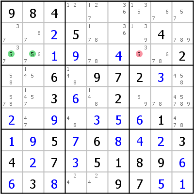
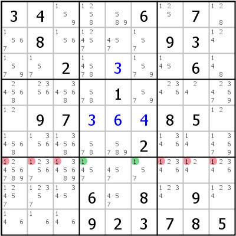
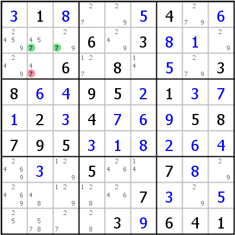
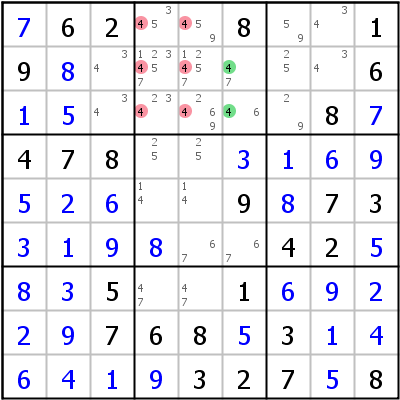
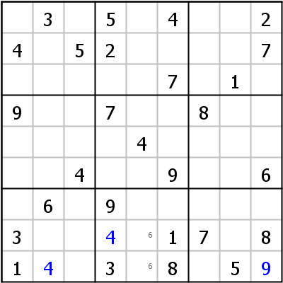
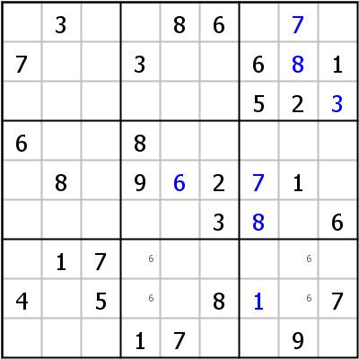

# Intersections

## Table of Contents

- [Locked Candidates Type 1 (Pointing)](#lc1)
- [Locked Candidates Type 2 (Claiming)](#lc2)
- [How to find them](#lc12)

------------------------------------------------------------------------

# Locked Candidates Type 1 (Pointing)

If in a block all candidates of a certain digit are confined to a row or column, that digit cannot appear outside of that block in that row or column.

 

Look at the left example: In block 1 candidate 5 can only go into row 3. That means, that one of the cells r3c1 or r3c2 has to be 5, or block 1 would be without 5, which is not possible. It also means, that 5 can be eliminated from r3c7, because r3c7 sees both r3c1 and r3c2. The sudoku solves with singles after that move.

Locked candidates moves can eliminate up to 6 candidates as can be seen in the example on the right: In box 8 candidate 1 is locked in row 7 and can therefore be eliminated from the intersection of boxes 7 and 9 with row 7.

------------------------------------------------------------------------

# Locked Candidates Type 2 (Claiming)

Locked Candidates Type 2 works exactly the other way round: If in a row (or column) all candidates of a certain digit are confined to one block, that candidate that be eliminated from all other cells in that block.

 

Look at the left example: In row 2 candidate 7 can only go into block 1. It can be eliminated from all cells in block 1 that don't belong to row 2, in our case cell r3c2. The sudoku solves with singles afterwards.

The example on the right shows a Locked Candidates move in a column: All 4s in column 6 are in block 2. They can be eliminated anywhere else in that block as shown in the image.

------------------------------------------------------------------------

# How to find them

 

Locked Candidates moves are usually found by inserting pencil marks into the grid whenever a candidate is confined to one row or column within a block. Look at the example on the left side: The 6 in r7c2 blocks row 7. In block 8 candidate 6 can therefore only go into column 5. That means that no 6 can be in column 5 in either block 2 or block 5 (Locked Candidates Type 1).

The example on the right shows the other variant: In block 8 candidate 6 can only go into column 4, in block 9 only into column 8. Since in both blocks the candidates 6 are confined to rows 7 and 8, in the third block of that chute (block 7) 6 has to be in row 9 (or to put in terms of the definition above: 6 can be safely eliminated from r8c2).

Locked Candidates can be identified easily, when filters are applied for a digit. For an example please see [Using Filters](docs_play.php#filters) in the Users Manual.

------------------------------------------------------------------------
