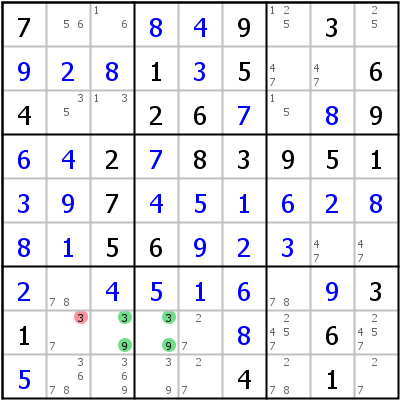
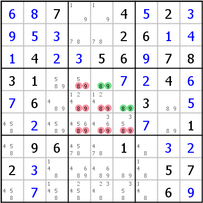
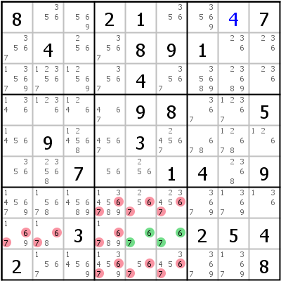
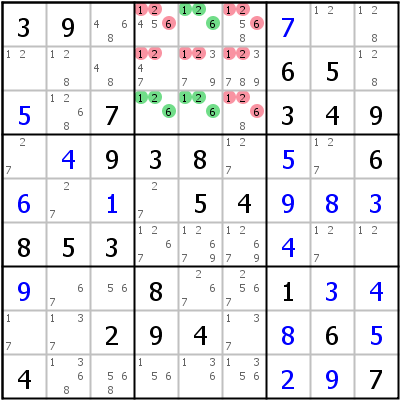
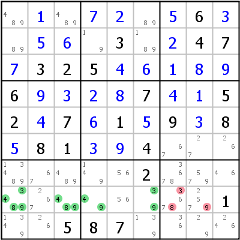

# Naked Subsets

## Table of Contents

- [Naked Pair/Locked Pair](#n2)
- - [Naked Pair](#n2n2)
  - [Locked Pair](#n2l2)
- [Naked Triple/Locked Triple](#n3)
- - [Naked Triple](#n3n3)
  - [Locked Triple](#n3l3)
- [Naked Quadruple](#n4)
- [How to find them](#n234)

------------------------------------------------------------------------

# Naked Pair/Locked Pair

Naked Subsets are similar to Hidden Subsets, the only difference is that it is not about candidates being confined to cells (as in Hidden Subsets), but about cells containing only a certain number of candidates.

## Naked Pair

If you can find two cells, both in the same house, that have only the same two candidates left, you can eliminate that two candidates from all other cells in that house.

 

Left example: cells r8c3 and r8c4 are both in the same house (row 8) and have both only candidates 3 and 9 left. It follows immediately that on of the cells has to be 3 and the other 9 (which is which is yet unknown). But we can safely say that r8c2 can not be 3. The sudoku solves with singles after that.

The example on the right shows a Naked Pair in a box: r4c5, r5c6 form a Naked Pair in box 5 thus eliminating candidates 8 and 9 from all other cells in that box.

## Locked Pair

If the two cells that form the Naked Pair are not only confined to one but to two houses (a row and a block or a column and a block), they are sometimes called a Locked Pair. Candidates can be eliminated from both houses.

 

On the left side r3c79 is a Locked Pair in row 3 and block 3, it therefore eliminates 2 from r3c3 (row 3) and from r1c9 (block 3). The right side shows a Locked Pair in row 8 and block 8 eliminating 18 candidates.

------------------------------------------------------------------------

# Naked Triple/Locked Triple

## Naked Triple

If you can find three cells, all in the same house, that have only the same three candidates left, you can eliminate that candidates from all other cells in that house. It is important to note that not all cells must contain all three candidates, but there must not be more than three candidates in the three cells all together.

 

Left example: cells r2c2, r4c2, and r5c2 are all in the same house (column 2) and together have only candidates 3, 6, and 9 left. It follows immediately, that one of the cells has to be 3, another 6, and the last 9 (which is which is yet unknown). But we can safely say that r1c2 cannot be 6. The sudoku solves with singles after that.

The example on the right shows a Naked Triple in a box: r3c45, r1c5 form a Naked Triple in box 2 thus eliminating candidates 1, 2, and 6 from all other cells in that box.

## Locked Triple

If the three cells that form the Naked Triple are not only confined to one but to two houses (a row and a block or a column and a block), they are sometimes called a Locked Triple. Candidates can be eliminated from both houses.

 

On the left side r789c5 is a Locked Triple in column 5 and block 8, it therefore eliminates 9 from r8c4 (block 8) and from r2c5 (column 5). The right side shows a Locked Triple on 5, 6, 7 in row 5 and block 6 eliminating 18 candidates.

------------------------------------------------------------------------

# Naked Quadruple

Naked Quadruples work in exactly the same way as Naked Pairs and Triples, just with four candidates in four cells. Since an intersection between a row or column and a box can have only three cells, a Locked Quadruple doesn't exist.

 

The left side shows a Naked Quadruple in row 8: candidates 3, 4, 8, 9 in cells r8c1346, eliminating 3 and 8 from r8c7 and 9 from r8c8. The right side has the Naked Quadruple in block 7: candidates 4, 6, 7, 9 in cells r8c2, r789c3.

------------------------------------------------------------------------

# How to find them

Finding Naked Subsets is best done, when all remaining candidates have been penciled in. If that is the case, they are rather easy to spot and very efficient.

------------------------------------------------------------------------
