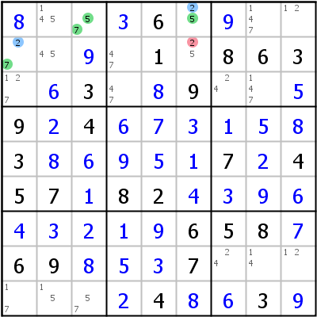
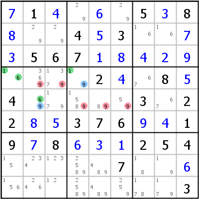
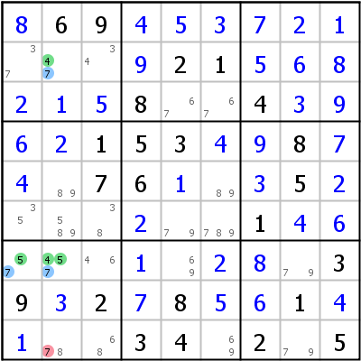
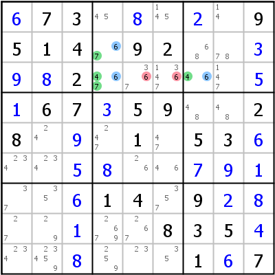
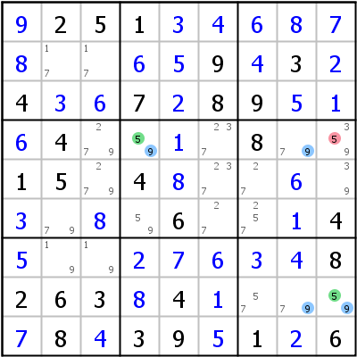
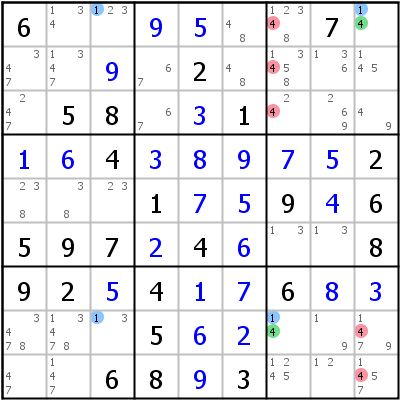

# Wings

## Table of Contents

- [XY-Wing](#xy)
- [XYZ-Wing](#xyz)
- [W-Wing](#w)

------------------------------------------------------------------------

# XY-Wing

An XY-Wing is really a short [XY-Chain](tech_chains.md#xyc) that is described as a pattern and thus can be found more easily. We start by looking for a bivalue cell (the pivot). The possible candidates in that cell are called X and Y. Now we try to find two other cells that see the pivot (the pincers). One of those cells contains candidates X and Z (Z is an arbitrary candidate different from X and Y) and the other candidates Y and Z. Now Z can be eliminated from any cell that sees both pincers.

 

Example on the left: Cell r1c3 (the pivot) contains candidates 5 (X) and 7 (Y). Cell r1c6 shares row 1 with the pivot and contains candidates 5 (X) and 2 (Z), cell r2c1 shares box 1 with the pivot and contains candidates 7 (Y) and 2 (Z). Cell r2c6 sees both pincers (r1c6 and r2c1). It cannot contain 2 (Z).

The logic is simple: If r1c3 is 5, r1c6 must be 2; if r1c3 is 7, r2c1 must be 2. In either case r2c6 cannot be 2. The equivalent [XY-Chain](tech_chains.md#xyc): 2- r2c1 -7- r1c3 -5- r1c6 -2 =\> r2c6\<\>2

Example on the right: X=1, Y=6, Z=9; pivot in r4c1, pincers in r4c4 and r5c2. Five candidates can be eliminated.

------------------------------------------------------------------------

# XYZ-Wing

The XYZ-Wing is an enhanced version of an [XY-Wing](#xy): Now the pivot contains not only candidates X and Y but Z as well. Consequently Z can only be eliminated from cells that see not only the pincers, but the pivot as well.

 

On the left: Pivot r7c2, pincers r2c2 and r7c1. If r7c2=4, r2c2=7 =\> r9c2\<\>7; if r7c2=5, r7c1=7 =\> r9c2\<\>7; if r7c2=7 =\> r9c2\<\>7.

On the right: 4/7/6 in r23c4,r3c7 =\> r3c56\<\>6

Expanded wings with even more candidates have been described, but they are hard to find and are not supported by HoDoKu.

------------------------------------------------------------------------

# W-Wing

W-Wings are easy to spot and often very efficient. They consist of two bivalue cells with the same candidates, that are connected by a [strong link](tech_chains.md#strong_link) on one of the candidates. The other candidate can be eliminated from all cells seeing both bivalue cells. Since a W-Wing is a chain internally, a prove of the logic written in plain text, as can be seen below, is complicated. The pattern itself, however, is easy to spot ([filters](docs_play.php#filters) can be a great help here).

 

On the left: The bivalue cells are r4c4 and r8c9 (candidates 5 and 9). The [strong link](tech_chains.md#strong_link) is for candidate 9 in column 8 (column 8 has only two possibilities for candidate 9, which means, that if one of them is not set, the other has to be set - strong link). One end of the strong link sees r4c4 the other sees r8c9. Candidate 5 can be eliminated from every cell that sees both r4c4 and r8c9.

Prove: We concentrate on the strong link in column 8: One of the two candidates 9 in r48c8 has to be placed. If r4c8=9, r4c4 has to be 5. If r8c8=9, r8c9 has to be 5. One of the cells r4c4 and r8c9 has to be 5 so each cell that see both of those two cells cannot be 5.

A W-Wing really is a chain as well. The above example as [Discontinuous Nice Loop](tech_chains.md#nl2): r4c9 -5- r4c4 -9- r4c8 =9= r8c8 -9- r8c9 -5- r4c9.

On the right: W-Wing: 4/1 in r1c9,r8c7 connected by 1 in r18c3 =\> r123c7,r89c9\<\>4

------------------------------------------------------------------------
